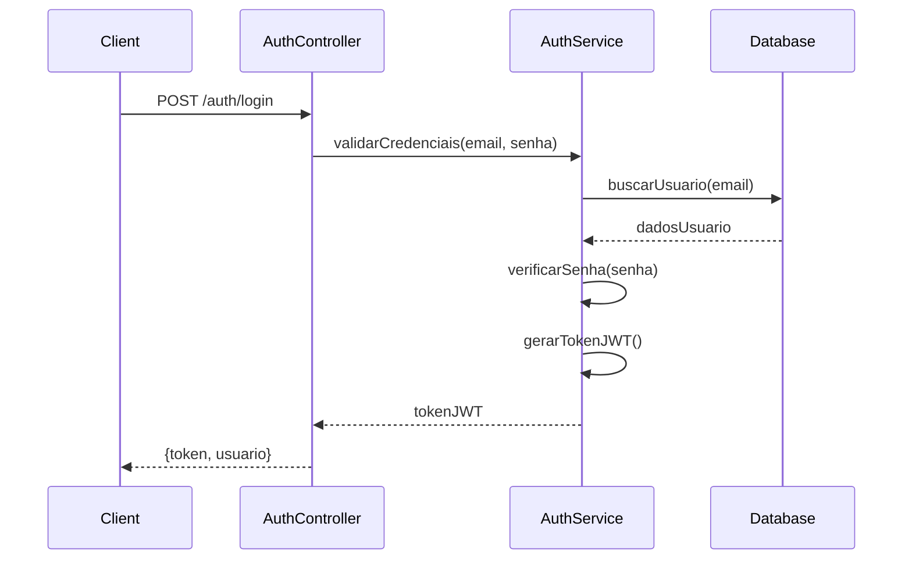
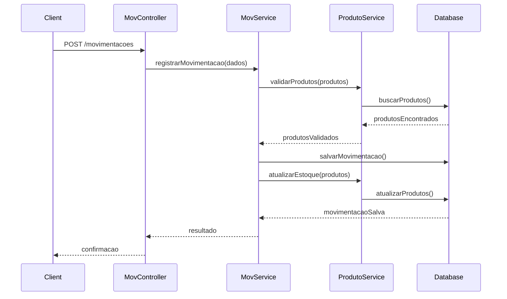
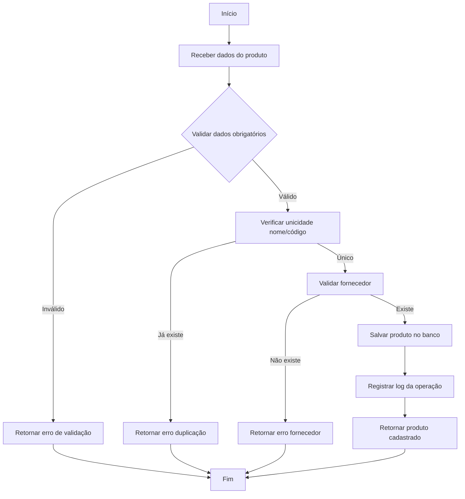

# PROJETO DE SOFTWARE - SISTEMA DE GESTÃO DE ESTOQUE

## *Stakeholders*
|NOME|CARGO|E-MAIL|
|:---|:---|:---|
|Dra. Valeria Arenhardt|Professora|valeria.arenhardt@ifro.edu.br|
|Roberto Simplicio Guimaraes|Professor|roberto.simplicio@ifro.edu.br|
|Wesley Jhonnes Ramos Rolim|Professor|wesley.rolim@ifro.edu.br|
|Erick Leonardo Weill|Professor|erick.weil@ifro.edu.br|


# Sumário

* [RESUMO DO PROJETO](#resumo-do-projeto)
* [EQUIPE DE DESENVOLVIMENTO](#equipe-de-desenvolvimento)
* [INTRODUÇÃO](#introdução)
  * [PROPÓSITO DESTE DOCUMENTO](#propósito-deste-documento)
  * [CONCEPÇÃO DO SISTEMA](#concepção-do-sistema)
* [DESCRIÇÃO GERAL](#descrição-geral)
  * [USUÁRIOS DO SISTEMA](#usuários-do-sistema)
  * [SUPOSIÇÕES E DEPENDÊNCIAS](#suposições-e-dependências)
* [ESTUDO DE VIABILIDADE](#estudo-de-viabilidade)
* [METODOLOGIA ADOTADA NO DESENVOLVIMENTO](#metodologia-adotada-no-desenvolvimento)
* [ARQUITETURA E TECNOLOGIAS](#arquitetura-e-tecnologias)
* [REQUISITOS DO SOFTWARE](#requisitos-do-software)
  * [REQUISITOS FUNCIONAIS](#requisitos-funcionais)
  * [REQUISITOS NÃO FUNCIONAIS](#requisitos-não-funcionais)
* [PROTOTIPAGEM](#prototipagem)
* [DIAGRAMA DE CASOS DE USO](#diagrama-de-casos-de-uso)
  * [ESPECIFICAÇÃO DOS CASOS DE USO](#descrição--especificação-dos-casos-de-uso)
* [DIAGRAMA DE CLASSES](#diagrama-de-classes)
* [DIAGRAMA DE SEQUÊNCIAS](#diagrama-de-sequências)
* [ DIAGRAMA DE ATIVIDADES](#diagrama-de-atividades)
* [REFERÊNCIAS](#referências)


# RESUMO DO PROJETO

|| |
|:---|:---|
| **NOME** |Sistema de Gestão de Estoque |
| **Lider do Projeto** | Ruan Lopes |
| **PRINCIPAL OBJETIVO** | Desenvolver um sistema web completo para gerenciamento de estoque com controle de usuários, produtos, fornecedores e movimentações |
| **BENEFÍCIOS ESPERADOS** | Automatizar o controle de estoque, melhorar a rastreabilidade de produtos e otimizar processos de reposição |
| **INÍCIO E TÉRMINO PREVISTOS** | 24/03/2025 - 21/07/2025 |

# EQUIPE DE DESENVOLVIMENTO

|NOME|FUNÇÃO|E-MAIL|
|:---|:---|:---|
|**Ruan Lopes**|Scrum Master - Analista - Desenvolvedor Backend|ruan.lopes@estudante.ifro.edu.br|
|**Henrique Zorzi**|Analista - Eng. de Dados - UI/UX Designer|henriquezorzi861@gmail.com|
|**André Porto**|Eng. de Dados|andrepporto2@gmail.com|

# INTRODUÇÃO

O Sistema de Gestão de Estoque é uma aplicação web completa desenvolvida em Node.js com MongoDB, projetada para automatizar e otimizar o controle de estoque de empresas. O sistema oferece funcionalidades abrangentes para gerenciamento de produtos, fornecedores, usuários e movimentações de estoque, com foco em segurança, auditoria e relatórios.

## PROPÓSITO DESTE DOCUMENTO

Este documento tem como objetivos:
- Especificar os requisitos funcionais e não funcionais do sistema
- Documentar a arquitetura e tecnologias utilizadas
- Definir os casos de uso e perfis de usuário
- Estabelecer critérios de qualidade e performance
- Servir como base para desenvolvimento e testes

## CONCEPÇÃO DO SISTEMA

O sistema foi concebido seguindo os princípios de:
- **Arquitetura em Camadas**: Separação clara entre controllers, services, repositories e models
- **API RESTful**: Endpoints padronizados para operações CRUD
- **Segurança**: Autenticação JWT e controle de permissões por perfil
- **Auditoria**: Log completo de todas as operações do sistema
- **Escalabilidade**: Estrutura preparada para crescimento e manutenção

# DESCRIÇÃO GERAL

O Sistema de Gestão de Estoque foi desenvolvido para atender às necessidades de controle e monitoramento de inventário de empresas de diversos segmentos. O sistema centraliza informações sobre produtos, fornecedores, movimentações e usuários, proporcionando visibilidade completa sobre o estado do estoque.

## Funcionalidades Principais

### Gerenciamento de Produtos
- Cadastro completo com informações detalhadas (nome, descrição, preço, custo, categoria)
- Controle de estoque atual e estoque mínimo
- Códigos únicos de identificação
- Associação com fornecedores
- Controle de status (ativo/inativo)

### Controle de Movimentações
- Registro de entradas e saídas de produtos
- Rastreamento de origem/destino das movimentações
- Histórico completo de movimentações
- Cancelamento de movimentações com reversão automática do estoque
- Auditoria de usuário responsável pela movimentação

### Gerenciamento de Fornecedores
- Cadastro completo com dados comerciais
- Controle de endereços múltiplos
- Associação com produtos fornecidos
- Histórico de relacionamento

### Sistema de Usuários e Permissões
- Três níveis de acesso: Administrador, Gerente e Estoquista
- Autenticação segura com JWT
- Controle de permissões por rota
- Sistema de recuperação de senha
- Auditoria de ações por usuário

## Usuários do sistema
|USUÁRIO|DESCRIÇÃO|PERFIL NO SISTEMA|
|:---|:---|:---|
|**Administrador:**|Acesso completo a todas as funcionalidades do sistema|`administrador`|
|**Gerente:**|Acesso a relatórios e funções de supervisão|`gerente`|
|**Estoquista:**|Operações diárias de estoque e movimentações|`estoquista`|

## Suposições e dependências

### Requisitos de Infraestrutura
- **Servidor**: Processador mínimo Intel Core i3 ou equivalente
- **Memória RAM**: Mínimo 4GB para aplicação
- **Banco de Dados**: MongoDB 4.4 ou superior
- **Node.js**: Versão 18 ou superior
- **Conectividade**: Conexão estável com a internet

### Dependências Tecnológicas
- **Express.js**: Framework web para Node.js
- **Mongoose**: ODM para MongoDB
- **JWT**: Autenticação e autorização
- **Bcrypt**: Criptografia de senhas
- **Winston**: Sistema de logs
- **Multer**: Upload de arquivos
- **Zod**: Validação de dados

# ESTUDO DE VIABILIDADE

## Análise de Viabilidade Técnica

### Tecnologias Utilizadas
- **Backend**: Node.js com Express.js
- **Banco de Dados**: MongoDB com Mongoose ODM
- **Autenticação**: JWT (JSON Web Tokens)
- **Validação**: Zod para validação de schemas
- **Logs**: Winston para auditoria
- **Testes**: Jest para testes unitários
- **Documentação**: Swagger para API

### Escalabilidade
O sistema foi projetado com arquitetura modular, permitindo:
- Crescimento horizontal do banco de dados MongoDB
- Implementação de cache (Redis) quando necessário
- Microserviços futuros
- Load balancing para alta disponibilidade

## Viabilidade Econômica

### Custos Estimados de Desenvolvimento
- **3 desenvolvedores** × **4 meses** × **R$ 4.000/mês** = **R$ 48.000**
- **Infraestrutura inicial**: R$ 2.000
- **Ferramentas e licenças**: R$ 1.000
- **Total estimado**: **R$ 51.000**

### Custos Operacionais Mensais
- **Servidor de aplicação**: R$ 200/mês
- **Banco de dados**: R$ 150/mês
- **Backup e monitoramento**: R$ 100/mês
- **Total mensal**: **R$ 450**

## Viabilidade Operacional
- **Tempo de implementação**: 4 meses
- **Treinamento de usuários**: 2 semanas
- **Período de adaptação**: 1 mês
- **ROI esperado**: 12 meses

# METODOLOGIA ADOTADA NO DESENVOLVIMENTO

A metodologia adotada foi o **Scrum**, com adaptações para o contexto acadêmico:

## Princípios Aplicados
- **Sprints de 2 semanas**: Entregas incrementais
- **Daily Standups**: Reuniões diárias da equipe
- **Sprint Planning**: Planejamento colaborativo
- **Sprint Review**: Demonstrações funcionais
- **Sprint Retrospective**: Melhoria contínua

## Ferramentas de Gestão
- **Git/GitHub**: Controle de versão e colaboração
- **Jest**: Testes automatizados
- **ESLint**: Padronização de código
- **Nodemon**: Desenvolvimento ágil
- **Swagger**: Documentação automática da API

# ARQUITETURA E TECNOLOGIAS

## Arquitetura do Sistema

```
├── src/
│   ├── controllers/     # Controladores das rotas
│   ├── services/        # Lógica de negócio
│   ├── repositories/    # Acesso aos dados
│   ├── models/          # Modelos do banco de dados
│   ├── routes/          # Definição das rotas
│   ├── middlewares/     # Middlewares de autenticação e validação
│   ├── utils/           # Utilitários e helpers
│   ├── config/          # Configurações do sistema
│   └── tests/           # Testes unitários
```

## Stack Tecnológico

### Backend
- **Node.js**: Runtime JavaScript
- **Express.js**: Framework web
- **MongoDB**: Banco de dados NoSQL
- **Mongoose**: ODM para MongoDB

### Segurança
- **JWT**: Tokens de autenticação
- **Bcrypt**: Hash de senhas
- **Helmet**: Proteção de cabeçalhos HTTP
- **CORS**: Controle de origem cruzada

### Qualidade e Testes
- **Jest**: Framework de testes
- **ESLint**: Linting de código
- **Zod**: Validação de schemas
- **Winston**: Sistema de logs

### Monitoramento
- **OpenTelemetry**: Observabilidade
- **Jaeger**: Rastreamento distribuído
- **Winston**: Logs estruturados

# REQUISITOS DO SOFTWARE

## Requisitos Funcionais

| IDENTIFICADOR | NOME | DESCRIÇÃO | STATUS |
|:---|:---|:---|:---|
|RF-001 |Autenticação de usuários|O sistema deve permitir login de usuários com diferentes níveis de acesso|✅ Implementado|
|RF-002 |Gerenciar cadastro de usuários|O sistema deve permitir cadastrar, editar e remover usuários do sistema|✅ Implementado|
|RF-003 |Cadastrar produtos|O sistema deve permitir o cadastro de produtos com informações completas (nome, preço, custo, categoria, estoque)|✅ Implementado|
|RF-004 |Buscar produtos|O sistema deve permitir buscar produtos por nome, categoria ou código|✅ Implementado|
|RF-005 |Editar informações de produtos|O sistema deve permitir alterar dados de produtos já cadastrados|✅ Implementado|
|RF-006 |Inativar produtos|O sistema deve permitir desativar produtos sem removê-los permanentemente|✅ Implementado|
|RF-007 |Gerenciar fornecedores|O sistema deve permitir cadastrar e manter informações de fornecedores|✅ Implementado|
|RF-008 |Registrar entrada de produtos|O sistema deve registrar quando produtos entram no estoque|✅ Implementado|
|RF-009 |Registrar saída de produtos|O sistema deve registrar quando produtos saem do estoque|✅ Implementado|
|RF-010 |Cancelar movimentações|O sistema deve permitir cancelar movimentações e reverter o estoque automaticamente|✅ Implementado|
|RF-011 |Controlar níveis de estoque|O sistema deve manter controle automático da quantidade disponível de cada produto|✅ Implementado|
|RF-012 |Definir estoque mínimo|O sistema deve permitir definir quantidade mínima para cada produto|✅ Implementado|
|RF-013 |Rastrear histórico de movimentações|O sistema deve manter histórico completo de todas as movimentações|✅ Implementado|
|RF-014 |Associar produtos a fornecedores|O sistema deve permitir vincular produtos aos seus respectivos fornecedores|✅ Implementado|
|RF-015 |Controlar acesso por perfil|O sistema deve restringir funcionalidades baseado no perfil do usuário (Administrador, Gerente, Estoquista)|✅ Implementado|
|RF-016 |Sistema de logs e auditoria|O sistema deve registrar todas as operações para auditoria|✅ Implementado|
|RF-017 |Gerenciar grupos de permissões|O sistema deve permitir criar e gerenciar grupos de permissões personalizados|✅ Implementado|

## Requisitos Não Funcionais

| IDENTIFICADOR | NOME | DESCRIÇÃO | STATUS |
|:---|:---|:---|:---|
|RNF-001 |Performance|O sistema deve responder às consultas em até 3 segundos|✅ Implementado|
|RNF-002 |Segurança|O sistema deve proteger dados sensíveis e controlar acesso de usuários|✅ Implementado|
|RNF-003 |Confiabilidade|O sistema deve manter consistência dos dados de estoque|✅ Implementado|
|RNF-004 |Disponibilidade|O sistema deve estar disponível durante horário comercial (99% uptime)|🟡 Planejado|
|RNF-005 |Usabilidade|O sistema deve ser intuitivo e de fácil aprendizado|🟡 Dependente do Frontend|
|RNF-006 |Escalabilidade|O sistema deve suportar crescimento no número de produtos e usuários|✅ Implementado|
|RNF-007 |Portabilidade|O sistema deve funcionar em diferentes sistemas operacionais|✅ Implementado|
|RNF-008 |Manutenibilidade|O código deve ser organizado e facilitar futuras modificações|✅ Implementado|
|RNF-009 |Integridade dos dados|O sistema deve garantir que os dados não sejam corrompidos|✅ Implementado|
|RNF-010 |Auditoria|O sistema deve manter rastro de quem fez cada operação|✅ Implementado|

# DIAGRAMA DE CASOS DE USO

![Diagrama de Casos de Uso - Em desenvolvimento]

## Descrição / Especificação dos Casos de Uso

### UC-01 - Autenticar Usuário

|UC-01 - Autenticar Usuário|           
|:---|
|**Descrição/Objetivo:** Permitir que usuários do sistema realizem login com credenciais válidas|
|**Atores:** Administrador, Gerente, Estoquista|
|**Pré-condições:** Usuário deve estar cadastrado no sistema e possuir credenciais válidas|
|**Pós-condições:** Usuário autenticado recebe token JWT para acesso às funcionalidades|
|**FLUXO PRINCIPAL / BÁSICO:**|
|1. Usuário acessa endpoint de login (/auth/login)|
|2. Sistema solicita email/matrícula e senha|
|3. Usuário fornece credenciais|
|4. Sistema valida credenciais no banco de dados|
|5. Sistema gera token JWT|
|6. Sistema retorna token e informações do usuário|
|**FLUXOS ALTERNATIVOS / EXCEÇÕES:**|
|**A1: Credenciais inválidas**|
|1. Sistema retorna erro 401 - Unauthorized|
|2. Usuário pode tentar novamente|
|**A2: Usuário bloqueado**|
|1. Sistema verifica se usuário está ativo|
|2. Se inativo, retorna erro específico|

### UC-02 - Gerenciar Produtos

|UC-02 - Gerenciar Produtos|           
|:---|
|**Descrição/Objetivo:** Permitir operações CRUD completas em produtos do estoque|
|**Atores:** Administrador, Gerente, Estoquista|
|**Pré-condições:** Usuário autenticado com permissões adequadas|
|**Pós-condições:** Produto cadastrado/atualizado/removido do sistema|
|**FLUXO PRINCIPAL / BÁSICO:**|
|1. Usuário acessa endpoints de produtos (/produtos)|
|2. Para cadastro: fornece dados obrigatórios (nome, preço, custo, categoria, estoque, fornecedor)|
|3. Sistema valida dados com schema Zod|
|4. Sistema persiste no banco MongoDB|
|5. Sistema retorna confirmação da operação|
|**FLUXOS ALTERNATIVOS / EXCEÇÕES:**|
|**A1: Dados inválidos**|
|1. Sistema retorna erros de validação específicos|
|2. Usuário corrige dados e tenta novamente|
|**A2: Produto já existe**|
|1. Sistema verifica unicidade do nome e código|
|2. Retorna erro se produto já existir|

### UC-03 - Registrar Movimentação

|UC-03 - Registrar Movimentação|           
|:---|
|**Descrição/Objetivo:** Registrar entradas e saídas de produtos no estoque|
|**Atores:** Administrador, Gerente, Estoquista|
|**Pré-condições:** Usuário autenticado e produtos cadastrados|
|**Pós-condições:** Movimentação registrada e estoque atualizado automaticamente|
|**FLUXO PRINCIPAL / BÁSICO:**|
|1. Usuário acessa endpoint de movimentações (/movimentacoes)|
|2. Especifica tipo (entrada/saida), destino e produtos|
|3. Sistema valida produtos e quantidades|
|4. Sistema registra movimentação|
|5. Sistema atualiza estoque automaticamente|
|6. Sistema registra log da operação|
|**FLUXOS ALTERNATIVOS / EXCEÇÕES:**|
|**A1: Estoque insuficiente (saída)**|
|1. Sistema verifica disponibilidade|
|2. Impede saída se estoque insuficiente|
|**A2: Produto não encontrado**|
|1. Sistema valida existência do produto|
|2. Retorna erro se produto inválido|

### UC-04 - Gerenciar Fornecedores

|UC-04 - Gerenciar Fornecedores|           
|:---|
|**Descrição/Objetivo:** Cadastrar e gerenciar informações de fornecedores|
|**Atores:** Administrador, Gerente|
|**Pré-condições:** Usuário autenticado com perfil adequado|
|**Pós-condições:** Fornecedor cadastrado/atualizado no sistema|
|**FLUXO PRINCIPAL / BÁSICO:**|
|1. Usuário acessa endpoints de fornecedores (/fornecedores)|
|2. Fornece dados obrigatórios (nome, CNPJ, telefone, email, endereço)|
|3. Sistema valida CNPJ e dados obrigatórios|
|4. Sistema persiste informações|
|5. Sistema confirma operação|
|**FLUXOS ALTERNATIVOS / EXCEÇÕES:**|
|**A1: CNPJ já cadastrado**|
|1. Sistema verifica unicidade do CNPJ|
|2. Impede cadastro duplicado|
|**A2: Dados inválidos**|
|1. Sistema valida formato de email, telefone, etc.|
|2. Retorna erros específicos|

### UC-05 - Controlar Acesso

|UC-05 - Controlar Acesso|           
|:---|
|**Descrição/Objetivo:** Controlar acesso às funcionalidades baseado no perfil do usuário|
|**Atores:** Sistema (Middleware de Autorização)|
|**Pré-condições:** Usuário autenticado com token JWT válido|
|**Pós-condições:** Acesso liberado ou negado conforme permissões|
|**FLUXO PRINCIPAL / BÁSICO:**|
|1. Sistema intercepta requisição com middleware|
|2. Valida token JWT|
|3. Extrai perfil do usuário|
|4. Consulta permissões para a rota solicitada|
|5. Libera ou nega acesso|
|**FLUXOS ALTERNATIVOS / EXCEÇÕES:**|
|**A1: Token inválido/expirado**|
|1. Sistema retorna erro 401|
|2. Cliente deve renovar autenticação|
|**A2: Permissão insuficiente**|
|1. Sistema retorna erro 403|
|2. Acesso negado para operação|

### UC-06 - Auditar Operações

|UC-06 - Auditar Operações|           
|:---|
|**Descrição/Objetivo:** Registrar logs de todas as operações para auditoria|
|**Atores:** Sistema (Middleware de Log)|
|**Pré-condições:** Operação sendo executada no sistema|
|**Pós-condições:** Log registrado com detalhes da operação|
|**FLUXO PRINCIPAL / BÁSICO:**|
|1. Sistema intercepta todas as requisições|
|2. Registra informações da operação (usuário, ação, timestamp)|
|3. Armazena logs estruturados|
|4. Disponibiliza para consultas administrativas|
|**FLUXOS ALTERNATIVOS / EXCEÇÕES:**|
|**A1: Falha no sistema de logs**|
|1. Sistema continua operação principal|
|2. Registra falha em log de erro|

# DIAGRAMA DE CLASSES

```mermaid
classDiagram
    class Usuario {
        +String nome_usuario
        +String email
        +String matricula
        +String senha
        +String perfil
        +Boolean ativo
        +Date data_cadastro
        +verificarSenha(senha)
    }
    
    class Produto {
        +String nome_produto
        +String descricao
        +Number preco
        +String marca
        +Number custo
        +String categoria
        +Number estoque
        +Number estoque_min
        +Date data_ultima_entrada
        +Boolean status
        +Number id_fornecedor
        +String codigo_produto
    }
    
    class Fornecedor {
        +String nome_fornecedor
        +String cnpj
        +String telefone
        +String email
        +Array endereco
        +Date data_cadastro
    }
    
    class Movimentacao {
        +String tipo
        +String destino
        +Date data_movimentacao
        +ObjectId id_usuario
        +String nome_usuario
        +Boolean status
        +Array produtos
    }
    
    Usuario ||--o{ Movimentacao : realiza
    Fornecedor ||--o{ Produto : fornece
    Produto ||--o{ Movimentacao : movimentado_em
```

# DIAGRAMA DE SEQUÊNCIAS

## Sequência: Autenticação de Usuário



## Sequência: Registro de Movimentação



# DIAGRAMA DE ATIVIDADES

## Atividade: Processo de Cadastro de Produto



# REFERÊNCIAS

1. **IEEE Std 830-1998** - IEEE Recommended Practice for Software Requirements Specifications
2. **MongoDB Documentation** - https://docs.mongodb.com/
3. **Node.js Documentation** - https://nodejs.org/docs/
4. **Express.js Guide** - https://expressjs.com/
5. **JWT.io** - https://jwt.io/
6. **Mongoose Documentation** - https://mongoosejs.com/docs/
7. **Scrum Guide** - https://scrumguides.org/
8. **REST API Design Best Practices** - RESTful Web Services

---

**Documento gerado em:** Junho de 2025  
**Versão:** 2.0  
**Status:** Em desenvolvimento  
**Próxima revisão:** Julho de 2025
